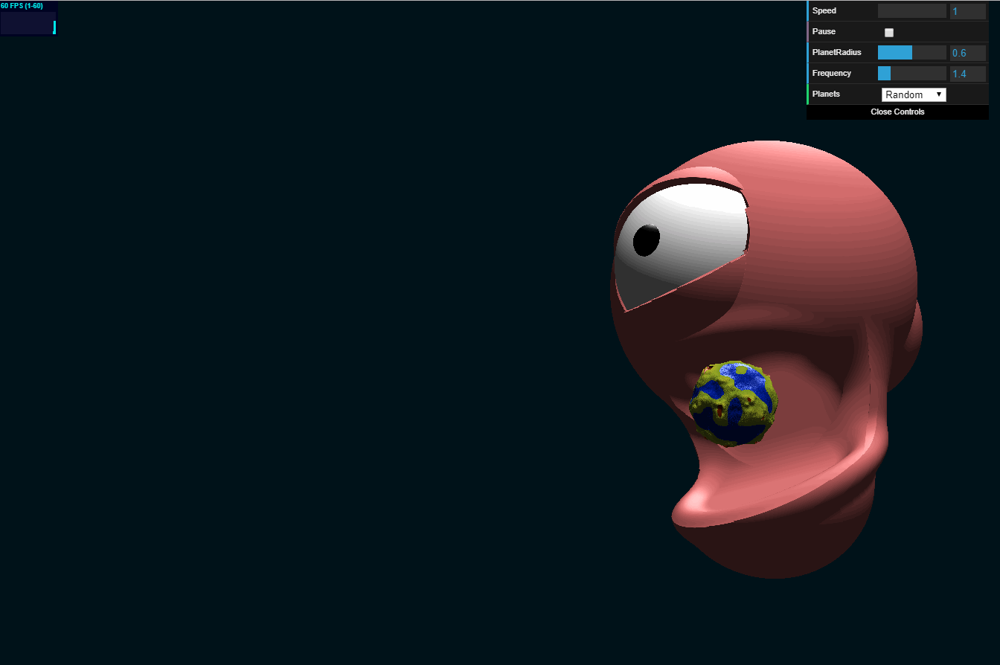
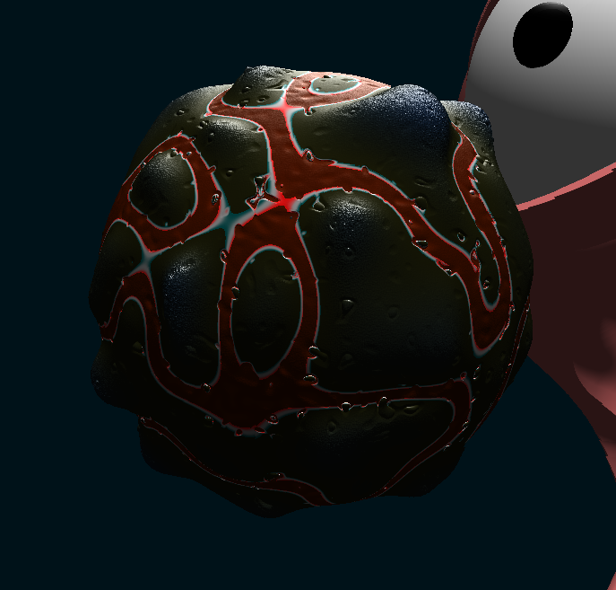

# CIS 566 Project 1: Noisy Planets

Charles Wang\
PennKey: chawang

## Project Overview

This project is an animation of a planet-eating super-planet. The super-planet draws in planets from neighboring solar systems with its gaze. Unfortunately the super-planet can only properly digest two types of planets: Earth-like and Hot Planets. 

You can hand pick planets to feed the super-planet by adjusting the selection (generation) patterns. You can also randomly feed the super-planet because it is not incredibly picky.

Hang out with the super-planet in a [live demo](http://charlesliwang.com/homework-1-noisy-planets-charlesliwang).

## Implementation

This scene is completely raymarched. The super-planet is a combination of sdfs, and the procedurally generated planets are sphere sdfs with a series of 3D perlin noise deformations. 

Each ray-marched result returns a float that corresponds to an appropriate material that drives diffuse and specular components.

The planet's surface is significantly more expensive to compute than the super-planet so a bounding sphere is ray-traced to cull ray-marching the planet unnecessarily. 

## My Planets

In computing the planet's surface, I used 3D perlin noise. Because my planets are ray-marched, I limited my sdf deformation computation to 3 perlin noise computations. I challenged myself to modify each single computation level of perlin noise several times to yield interesting results.

Overall, noise computation for my planets is quite simple: layer different frequencies of noise by multiplying, adding, or subtracting. 

Both planet types include a "sea-level." 
Sea-level is determined by creating a clamped version the "base-level" perlin noise. Because the original, un-clamped noise is continuous at the sea-level, using this original base-level noise to scale noise (that may be different above and below sea-level) will ensure that there are no gaps in the surface. If these planets were implemented by vertex deformation on an sphere geometry, this wouldn't be as much of an issue because of the connected faces.

### Earth-like Planet
The super-planet's staple food

The volcano-like structures are formed by clamping the upper noise values (~0.7) and subtracting values from the original noise that are a step higher (~0.8).\
Specular highlight on the water, but just lambert on land.

### Hot Planet
When Earth-like Planets feel too bland

The small, sharp circular dips are formed by isolating a mid-frequency noise to some intermediate value-range (values below t0 and above t1 have little contribution).\
The same, mid-freqency noise is used for the pulsing in the lava. Because the full range is affecting the final displacement, it appears as a different frequency level.

One trick I found was:\
Remap a noise output to [-1,1], absolute value the output, remap the value with "fade" to create a curved transition near 0. This essentially gives you another frequency of noise to work with that may have cool coinciding behavior with the base noise. In retrospect, I would have used this more. 

## References
- [IQ sdf reference](http://iquilezles.org/www/articles/distfunctions/distfunctions.htm)
- [IQ Shadertoy example](https://www.shadertoy.com/view/Xds3zN)

## Useful Links
- [Implicit Procedural Planet Generation](https://static1.squarespace.com/static/58a1bc3c3e00be6bfe6c228c/t/58a4d25146c3c4233fb15cc2/1487196929690/ImplicitProceduralPlanetGeneration-Report.pdf)
- [Curl Noise](https://petewerner.blogspot.com/2015/02/intro-to-curl-noise.html)
- [GPU Gems Chapter on Perlin Noise](http://developer.download.nvidia.com/books/HTML/gpugems/gpugems_ch05.html)
- [Worley Noise Implementations](https://thebookofshaders.com/12/)
